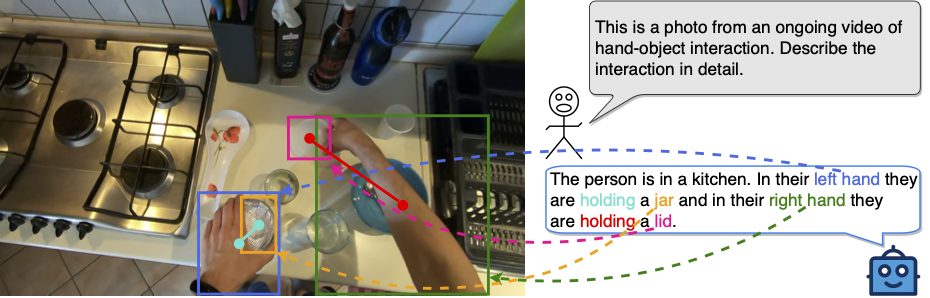

# HOI-Ref

<font size='5'><a href="https://arxiv.org/abs/2404.09933">**HOI-Ref: Hand-Object Interaction Referral in Egocentric Vision**</a></font>

Siddhant Bansal, Michael Wray, and Dima Damen

<a href='https://sid2697.github.io/hoi-ref/'></a> <a href='https://arxiv.org/abs/2404.09933'></a> <a href=''></a>

<center>
<figure>
		<div id="projectid">
    
		</div>
    <figcaption>
    Given an image from an egocentric video, the goal here is to refer the hands and the objects being interacted with. For example, here we wish to refer the left and right hand along with the two objects (jar and lid) that the hands are interacting with.
    </figcaption>
</figure>
</center>

## Getting Started
### Installation

**1. Prepare the code and the environment**

Git clone our repository, creating a python environment and activate it via the following command

```bash
git clone https://github.com/Sid2697/HOI-Ref
cd HOI-Ref
conda env create -f environment.yml
conda activate hoiref
```


**2. Prepare the pretrained LLM weights**

**VLM4HOI** is based on Llama2 Chat 7B.
Download the corresponding LLM weights from the following huggingface space via clone the repository using git-lfs.

|                            Llama 2 Chat 7B                             |
:------------------------------------------------------------------------------------------------:|
[Download](https://huggingface.co/meta-llama/Llama-2-7b-chat-hf/tree/main) | 


Then, set the variable *llama_model* in the model config file to the LLM weight path.

* Set the LLM path 
[here](vlm4hoi/configs/models/vlm4hoi.yaml#L14) at Line 14.

**3. Prepare the pre-trained VLM4HOI checkpoints**

Download the pre-trained VLM4HOI checkpoints from [this dropbox link](https://www.dropbox.com/scl/fi/o8c8surg8ovqmqpx3xl8j/checkpoint_55.pth?rlkey=u74w6o7wnmrx88jleewqd9qoh&dl=0).

Set the path to the pre-trained checkpoint in the evaluation config file 
in [eval_configs/vlm4hoi_benchmark_evaluation.yaml](eval_configs/vlm4hoi_benchmark_evaluation.yaml#L9) at Line 9.

### Launching VLM4HOI Demo Locally

Run
```
python demo.py --cfg-path eval_configs/vlm4hoi_benchmark_evaluation.yaml  --gpu-id 0
```

To save GPU memory, LLMs loads as 8 bit by default, with a beam search width of 1. 
This configuration requires about 11.5G GPU memory for 7B LLM. 
For more powerful GPUs, you can run the model
in 16 bit by setting `low_resource` to `False` in [vlm4hoi_benchmark_evaluation.yaml](eval_configs/vlm4hoi_benchmark_evaluation.yaml#L6) 

### Fine-tuning VLM4HOI

Before going ahead, make sure you have downloaded the HOI-QA dataset and extracted all the required frames. Refer to this [HOI-QA README](hoiqa_dataset/HOIQA_README.md) for downloading and preparing the dataset.

In the train_configs/vlm4hoi_finetune.yaml, you need to set up the following paths:

llama_model checkpoint path [here](train_configs/vlm4hoi_finetune.yaml#L7): "/path/to/llama_checkpoint"

ckpt [here](train_configs/vlm4hoi_finetune.yaml#L8): "/path/to/pretrained_checkpoint"

output_dir [here](train_configs/vlm4hoi_finetune.yaml#L52): "/path/to/output/directory"

For ckpt, you may load from our pre-trained model checkpoints downloaded earlier.

```bash
torchrun --nproc-per-node NUM_GPU train.py --cfg-path train_configs/vlm4hoi_finetune.yaml
```

### Evaluation

To evaluate VLM4HOI on HOI-QA Dataset, run the following command:

```bash
python -m eval_scripts.eval_hoiqa --cfg-path eval_configs/vlm4hoi_benchmark_evaluation.yaml --pred_json /path/to/save/the/predictions.json
```

Once this script finishes, you will have all the predictions saved to `/path/to/save/the/predictions.json`. Run the following script to get the final numbers (as reported in the paper):

```bash
python -m eval_scripts.evaluate --pred_json /path/to/save/the/predictions.json --hoi_pred_json /path/to/save/the/predictions_hoi.json
```
Running this script will print all the numbers as reported in the paper.

## Acknowledgement

This repository is built upon [MiniGPT-v2](https://github.com/Vision-CAIR/MiniGPT-4)!


## Bibtex

If you're using VLM4HOI or the HOI-QA dataset in your research or applications, please cite the paper using this BibTeX:

```bibtex
@article{bansal2024hoiref,
  title={HOI-Ref: Hand-Object Interaction Referral in Egocentric Vision},
  author={Bansal, Siddhant and Wray, Michael, and Damen, Dima},
  journal={arXiv preprint arXiv:2404.09933},
  year={2024}
}
```

## License
This repository is under [BSD 3-Clause License](LICENSE.md).
Many code are based on [MiniGPT-v2](https://github.com/Vision-CAIR/MiniGPT-4) with BSD 3-Clause License [here](LICENSE_MiniGPT-v2.md) which is in-turn based on [Lavis](https://github.com/salesforce/LAVIS) with 
BSD 3-Clause License [here](LICENSE_Lavis.md).
