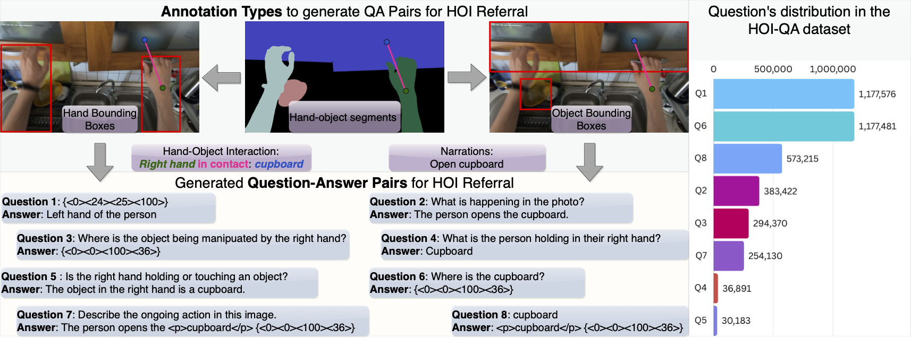

# HOI-QA: Dataset for Hand-Object Interaction Referral

<figure>
		

    
		

    <figcaption align="justify">
    HOI-QA for training VLMs to understand hand-object interaction. We use multiple annotation types to create the question-answer pairs. Top shows the annotations utilised and Bottom shows the types of question-answer pairs generated from these annotations. As shown, we convert the segments to bounding boxes to generate various referral questions and utilise contact information to understand interaction between hands and objects. Right shows the distribution of questions in the proposed HOI-QA dataset.
    <b>HOI-QA consists of 3.9M question-answer pairs.</b>
    </figcaption>
</figure>

The dataset consists of the following five files:
* `ego4d-test.json`: Test set QA Pairs in HOI-QA from the Ego4D dataset
* `ego4d-train.json`: Train set QA Pairs in HOI-QA from the Ego4D dataset
* `epic-kitchens-train.json`: Train set QA Pairs in HOI-QA from the EPIC-Kitchens dataset
* `epic-test.json`: Test set QA Pairs in HOI-QA from the VISOR portion of the EPIC-Kitchens dataset
* `epic-visor-test.json`: Test set QA Pairs in HOI-QA from the EPIC-Kitchens dataset 

Download these files form this dropbox link and save them in `hoiqa_dataset` directory (where this README lives).
Refer to the paper for the details on how the question answer pairs were created.

There are these two files to help assist frame extraction:
* `ego4d-clip-ids.json`: Clip ids of the videos from Ego4D used in the HOI-QA dataset.
* `epic-video-ids.json`: Video id of the videos from EPIC-Kitchens used in the HOI-QA dataset.

Using the above two files, download the videos from EPIC-Kitchens and Ego4D. Extract the frames for Ego4D in `Ego4D/v2/frames/{clip_uid}/frame_{frame_number}.jpg` and for EPIC-Kitchens in `EPIC_Kitchens/frames/{video_id}/frame_{frame_number}.jpg`.

Note that the questions for the test datasets (`epic-test.json` and `ego4d-test.json`) are created on the fly by the test data loaders (for example, [EPICEvalDataRef](../vlm4hoi/datasets/datasets/epic_conversation.py#L100) and [EPICEvalDataIDEN](../vlm4hoi/datasets/datasets/epic_conversation.py#L121)).
